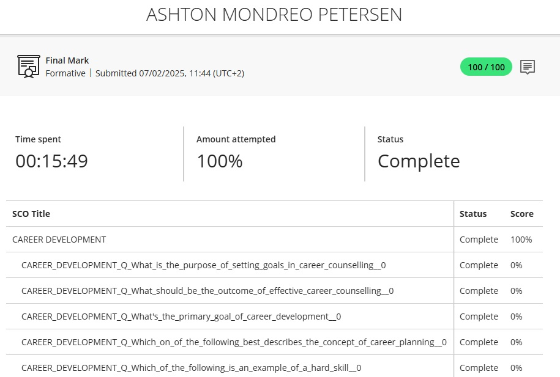
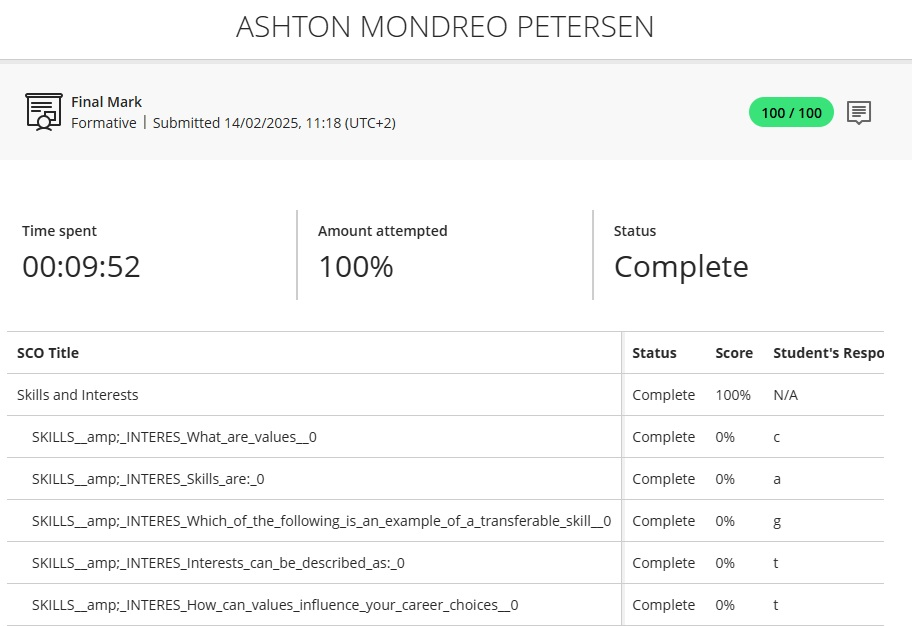
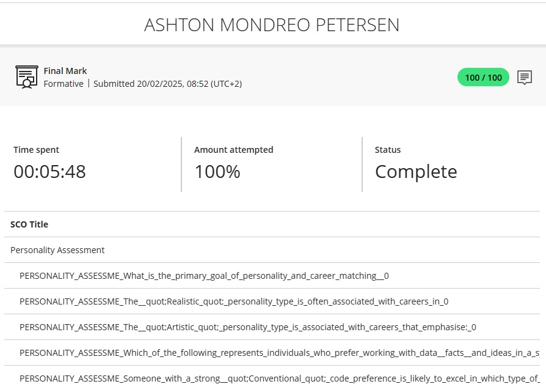
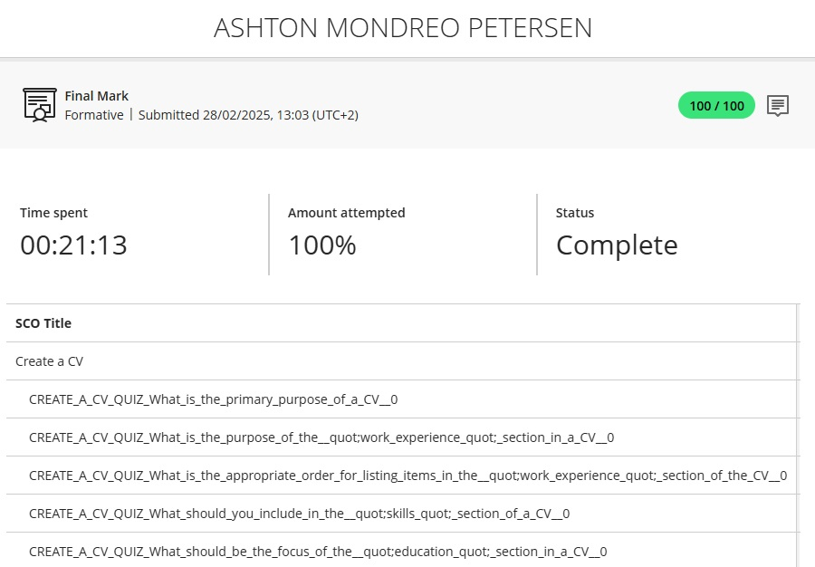
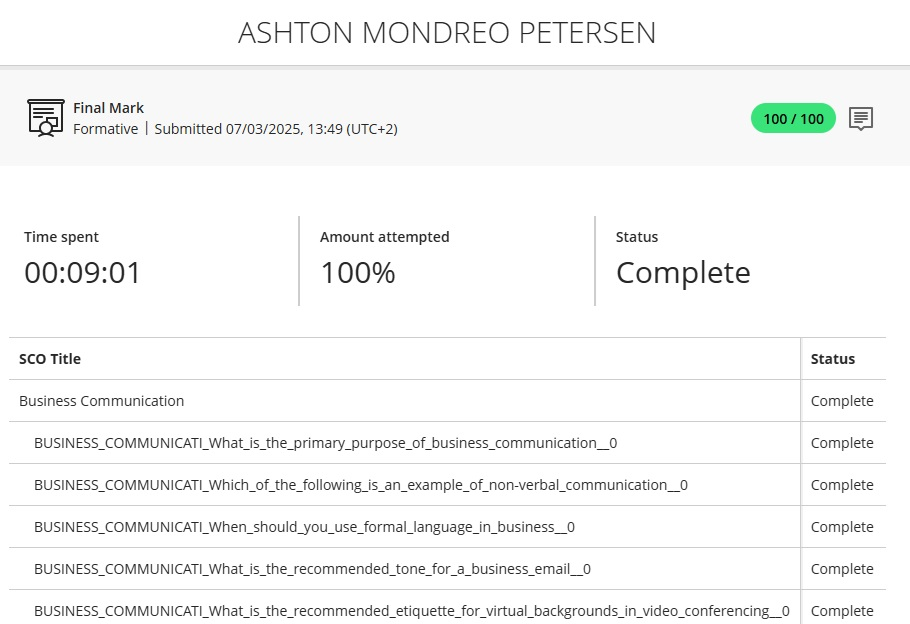
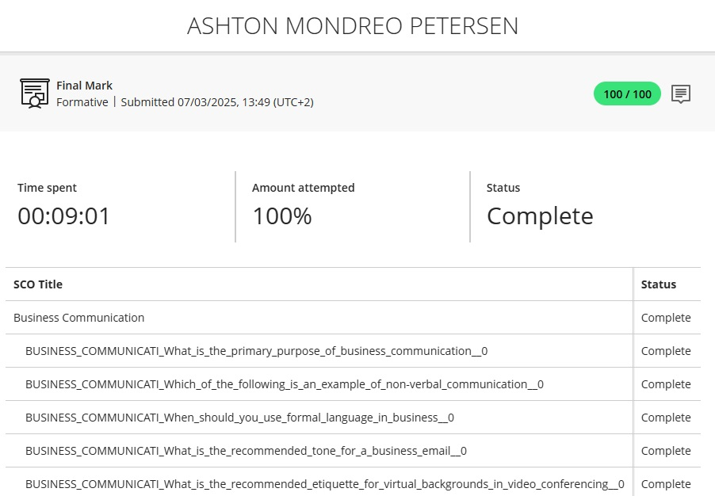
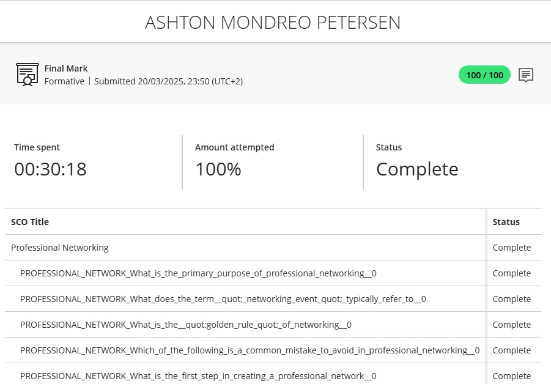
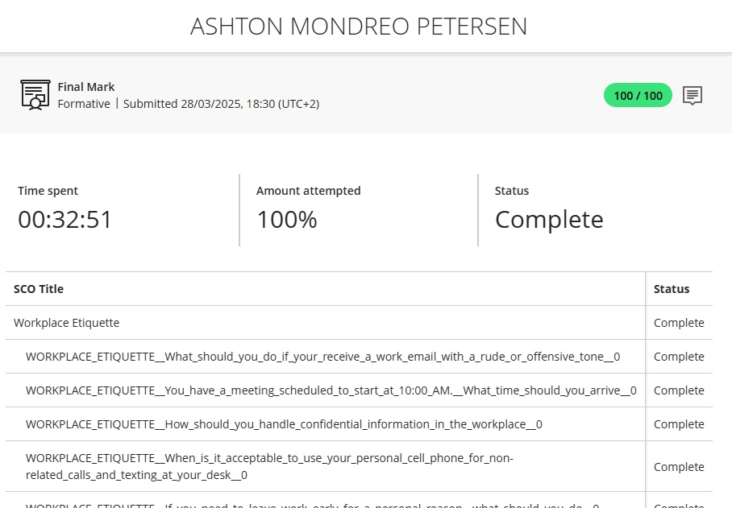

# 220219494-Digital-Portfolio
# Modules

## Career Counseling
### Evidence

![alt][id]
⋮
[id]: CareerDevelopment.jpg "title"
### Reflection

## Skills And Interests
### Evidence

![alt][id]
⋮
[id]: SkillsAndInterests.jpg "title"
### Reflection

## Personality Assessment
### Evidence

![alt][id]
⋮
[id]: PersonalityAssessment.jpg "title"
### Reflection

## Create a CV
### Evidence

![alt][id]
⋮
[id]: CreateACV.jpg "title"
### Reflection

## Business Communication
### Evidence

![alt][id]
⋮
[id]: BusinessCommunication.jpg "title"
### Reflection

## Interview Skills
### Evidence

![alt][id]
⋮
[id]: InterviewSkills.jpg "title"
### Reflection

## Professional Networking
### Evidence

![alt][id]
⋮
[id]: ProfessionalNetworking.jpg "title"
### Reflection

## Workplace Etiquette
### Evidence

![alt][id]
⋮
[id]: WorkplaceEtiquette.jpg "title"
### Reflection

# Work Readiness
## CV Submission
### Evidence

### Reflection

## Mock Interview Video
### Evidence

### Reflection

# Previous Work

