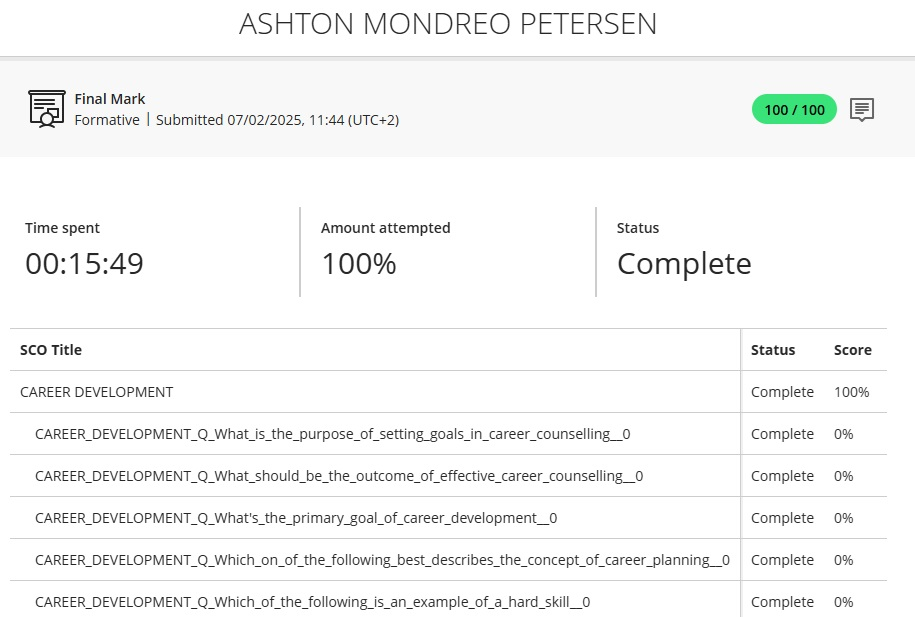
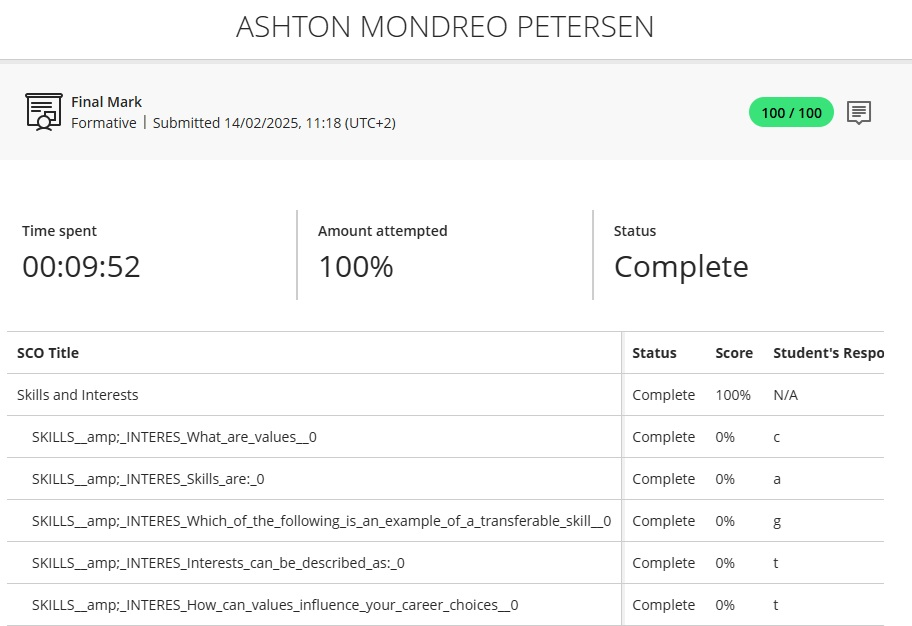
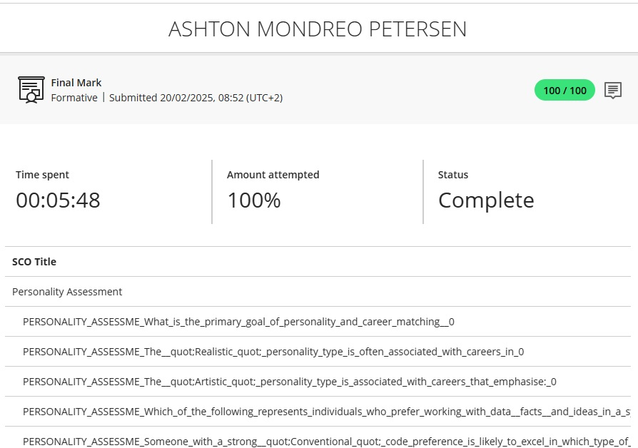
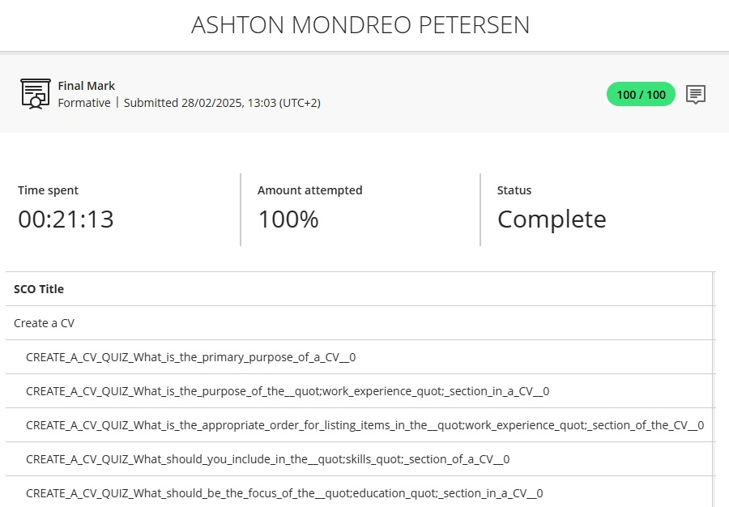
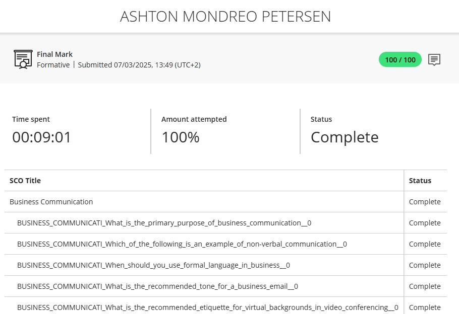
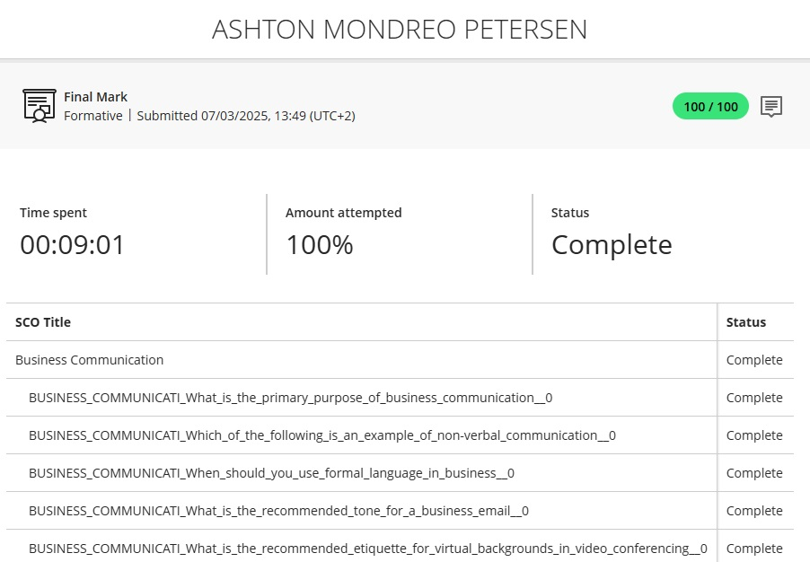
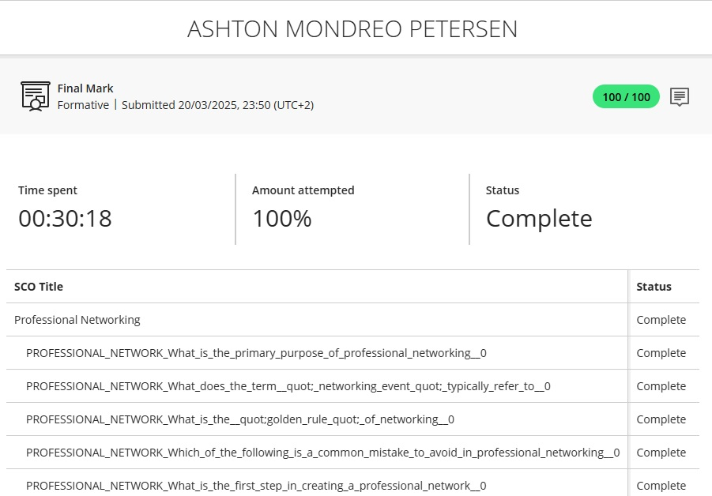
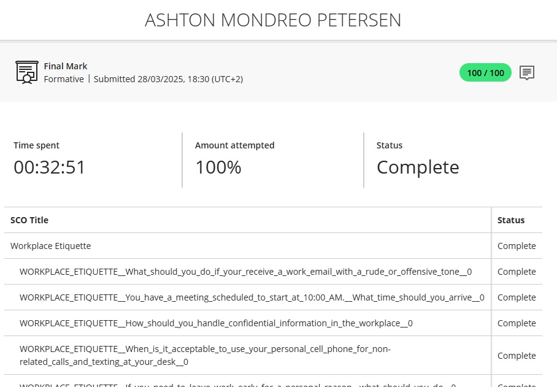

# 220219494-Digital-Portfolio

# Contact Details
Name: Ashton Mondreo Petersen

Student Number: 220219494

Cell Phone Number: 0613524805

Personal Email: <ashtonpetersen0@gmail.com>

Student Email: <220219494@mycput.ac.za>

# Semester 1
## Modules

### Career Counseling
#### Evidence

#### Reflection
As part of my work readiness modules I was required to reflect on what is a career and how to go about choosing one.
After completing this module I took time to consider what I am looking for in a career in terms of goals and aspects relating to the job. I identified that distance, transportation and the abilitiy to grow my talents are important when choosing a career.
At the end of the module, I have gained a better understanding of what a career is and how to plan my career journey to align with my goals.

### Skills And Interests
#### Evidence

#### Reflection
A part of my work readiness preperation modules we had to identify the purpose of our values, vocational interests and our skills in our job search. 
I aimed to identify my values, interests and my skills that could be applied to jobs. Firstly, in order to identify my values to understand what makes me fulfilled and what drives my decisions, then I identify professional interests to work in a career that increases my satisfaction in the position and finally I identify skills in order to have more engagement with the work I do and increase my confidence in my capabilities. 
This has made me more concious and analytical of my career choices, choosing ones that align with my skills, values and interests.

### Personality Assessment
#### Evidence

#### Reflection
This work preparedness module outlines what personality traits are desirable in a job, what influences your personality, why knowing your personality is important and what the 6 personality types there are.
I aimed to identify my personality traits and how it has affected my career choices and what sort of personality fits my desired position.
I performed a personality assessmenet to better identify what energizes me, how I take in information and how it affects my decisions and how I approach life.
After completing the module I have a better understanding of how my personality can affect my suitability for certain jobs and how to better my chances in my career journey by understanding and emulating traits that fit the position I am applying for.

### Create a CV
#### Evidence

#### Reflection
In this module, I was tasked with understanding what a CV is and what purpose it serves.
My goal for this module is to learn what makes a good CV and creating my own CV.
I worked on the first draft of my CV.
By the end of the module, I have completed first draft of my CV and have built an understanding of the purpose of creating a CV when marketing myself to potential employers.

## Work Readiness
### CV Submission
#### Evidence
[Uploaded-CV-Click-Here-To-View](https://docs.google.com/document/d/1Q3M5Gce_tJ5_a_tTskNA881lgXKOviXHU_QOXq1_3Cw/edit?usp=sharing)
#### Reflection
I was assigned a task to create a CV that can be used to professionally market myself to employers and found that my original draft of my CV needed improvement.
I aimed to add sections to better display my talents, outline my career goals and provide evidence of my academic achievements.
I edited my CV to outline my goals and have additional information in regards to eligibility for a career while keeping in mind that my CV will be a dynamic document.

# Semester 2
## Modules
### Business Communication
#### Evidence

#### Reflection
As part of my work readiness modules I was required to reflect on busines communication.
After completing this module I reflected on communication methods in a professional enviroment .
At the end of the module, through learning communication methods and how to communicate effectively, I've learnt the importance of communication in the workplace, how it can be used to be improve workflow and interpersonal relationships/collaboration at work and what different forms of communication are used in the workplace.

### Interview Skill
#### Evidence

#### Reflection
A part of my work readiness preperation modules I had to learn various skills in order to go through with interviews.
This module was aimed towards outlining what we need to do when it comes to our interviews. In order to prepare myself for interviews, I have both studied this module, watched guides online of how to perform in interviews and have done a mock interview video in order to practice for an interview.
This has made me more aware of how to deal with interviews and what sort of questions will be asked and how to learn them.

### Professional Networking
#### Evidence

#### Reflection
This work preparedness module outlines how to network as a professional and as a brand as well as what role a network can play in finding oppurtunities.
I aimed to identify places to build such a network and have attempted to use sites such as LinkedIn and Instagram to build my own network in order to put the modules teachings into practice.
After completing the module my understanding of networks in the professional environment has been broadened and I am attempting to apply the lessons in my connections going forward.

### Workplace Etiquette
#### Evidence

#### Reflection
As part of my work readiness modules focused on how etiquette in the workplace.
After completing this module I took time to familiarise myself with company policy, decorum and etiquette. I identified that when working in a professional enviroment there needs to be a degree of professionalism in my demeanor, actions and drive to get work done.
At the end of the module, I have gained a better understanding constitutes proper etiquette in the workplace. 

## Work Readiness

### Mock Interview
#### Evidence
[Uploaded-Interview-Video-Click-Here-To-View](https://drive.google.com/file/d/1GWG9e0l-piQz6Mbpo-Qd3fuY11_iUWfu/view?usp=drive_link)
#### Reflection
I was assigned a task to create a mock interview video in order to get better accustomed with answering questions in an interview and while doing the task I have gained more confidence in my ability to market myself to potential employers as well as a better understanding of myself and career goals
I aimed to answer the sample questions provided and researhed what possible answers apply.
I then drafted up a better outline for my mock interview that better and clearly outlines my methodology and career goals. I also used my skills in video editing to edit the video, removing irrelevant information, gaps in the footage and to synthesize it to be more concise.
